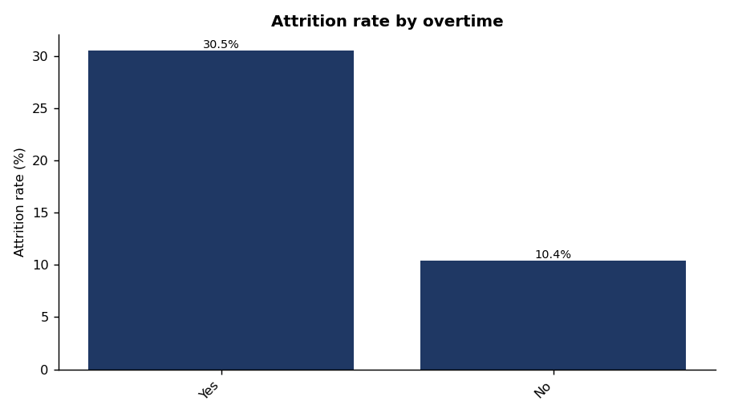
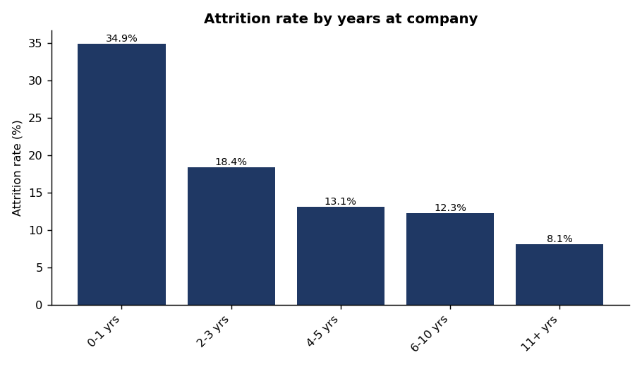
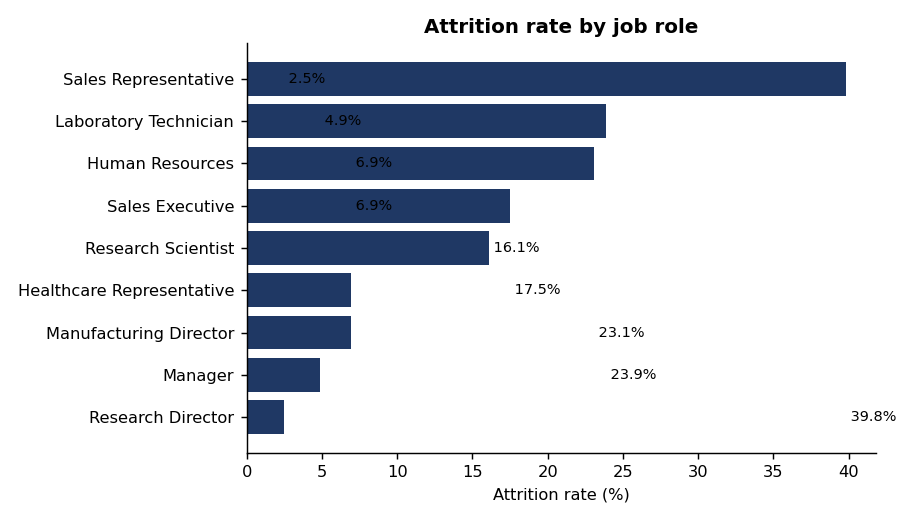
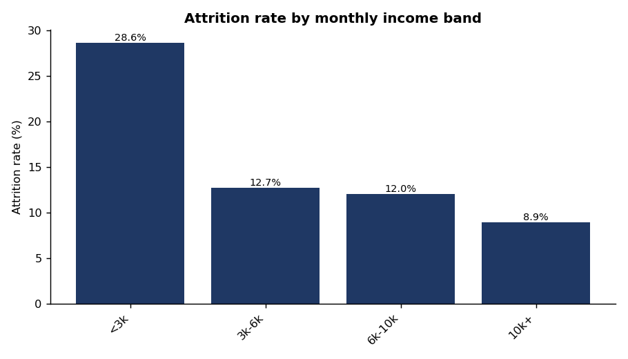
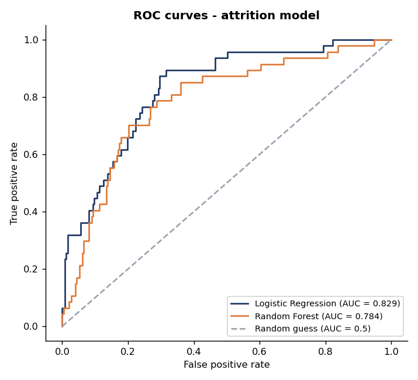
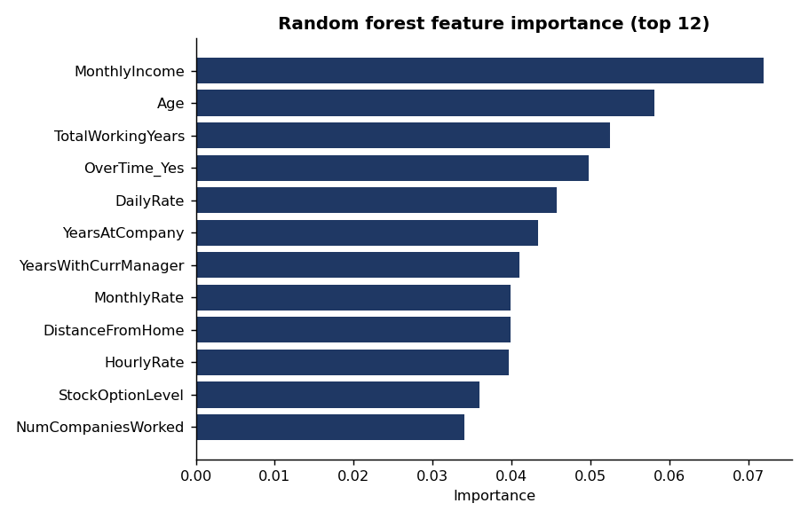

# IBM HR Analytics — Employee Attrition & Performance

An end-to-end, entry-level **data analyst portfolio project** I built to cover the complete
workflow: raw data -> research -> data understanding -> data quality -> cleaning ->
EDA -> business questions -> statistics -> SQL -> Python -> machine learning ->
Power BI -> insights -> recommendations -> documentation 

**I made everything in this repository reproducible.** Every number below came from
the committed data and the committed code.

---

## Project at a glance

| | |
|---|---|
| **Dataset** | IBM HR Analytics Employee Attrition & Performance — 1,470 employees, 35 variables (synthetic, created by IBM data scientists) |
| **Business question** | The overall attrition rate is 16.1%, but which segments drive it, how strong is each factor, and can attrition be predicted well enough to prioritise retention? |
| **Tools** | Python (pandas, NumPy, scipy, scikit-learn, matplotlib), SQL, Jupyter, HTML/SVG, Git |
| **Headline finding** | 16.1% overall attrition conceals 30.5% among overtime workers and 34.9% among first-year employees |
| **Best model** | Logistic regression — ROC-AUC 0.829, recall 0.702, PR-AUC 0.525 |
| **Deliverables** | Interactive dashboard, 8 charts, analytical reports, SQL analysis, Python scripts, and Jupyter notebooks |

---

## Headline KPIs

| KPI | Value |
|---|---|
| Total employees | 1,470 |
| Employees who left | 237 |
| Attrition rate | 16.1% |
| Retention rate | 83.9% |
| Average age | 36.9 |
| Average monthly income | 6,503 (median 4,919) |
| Average tenure | 7.0 years |
| Overtime rate | 28.3% |
| Average job satisfaction | 2.73 / 4 |
| Average work-life balance | 2.76 / 4 |
| Average job involvement | 2.73 / 4 |

---

## Key findings

### 1. Overtime is the strongest single signal

| OverTime | Employees | Leavers | Attrition rate |
|---|---|---|---|
| Yes | 416 | 127 | **30.5%** |
| No | 1,054 | 110 | 10.4% |

Chi-square 87.56, p = 8.2e-21, Cramér's V = 0.244 — the strongest association tested.
Overtime raises attrition in 8 of 9 job roles.



### 2. Attrition is concentrated in early tenure

| Tenure band | Employees | Leavers | Attrition rate |
|---|---|---|---|
| 0–1 yrs | 215 | 75 | **34.9%** |
| 2–3 yrs | 255 | 47 | 18.4% |
| 4–5 yrs | 306 | 40 | 13.1% |
| 6–10 yrs | 448 | 55 | 12.3% |
| 11+ yrs | 246 | 20 | 8.1% |



### 3. Job role matters more than department

| Job role | Employees | Leavers | Attrition rate |
|---|---|---|---|
| Sales Representative | 83 | 33 | **39.8%** |
| Laboratory Technician | 259 | 62 | 23.9% |
| Human Resources | 52 | 12 | 23.1% |
| Sales Executive | 326 | 57 | 17.5% |
| Research Scientist | 292 | 47 | 16.1% |
| Healthcare Representative | 131 | 9 | 6.9% |
| Manufacturing Director | 145 | 10 | 6.9% |
| Manager | 102 | 5 | 4.9% |
| Research Director | 80 | 2 | 2.5% |



### 4. The two cuts the dataset page asks for

**Distance from home by job role × attrition (means):** leavers commute farther in
6 of 9 roles — Healthcare Representative 9.2 → 17.7 and Human Resources 6.6 → 13.4
are the largest gaps. Several cells are tiny (Research Director has only 2 leavers),
so this is directional rather than uniform.

**Monthly income by education × attrition (means):** at **every** education level
leavers earned less — Below College 5,926 → 4,360; College 6,586 → 4,283;
Bachelor 6,883 → 4,770; Master 7,088 → 5,335; Doctor 8,560 → 5,850.

### 5. Other clear patterns

| Segment | Highest | Lowest |
|---|---|---|
| Income band | < 3k: 28.6% | 10k+: 8.9% |
| Stock option level | 0: 24.4% | 2: 7.6% |
| Job involvement | Low: 33.7% | Very High: 9.0% |
| Work-life balance | Bad: 31.2% | Better: 14.2% |
| Marital status | Single: 25.5% | Divorced: 10.1% |
| Age band | 18–25: 35.8% | 36–45: 9.2% |



---

## The most important lesson I took from this work

A model that **always predicts "no attrition"** scores **84% accuracy** on this
dataset — higher than either real model.

| Metric | Logistic Regression | Random Forest | Do-nothing baseline |
|---|---|---|---|
| Accuracy | 0.765 | 0.823 | **0.840** |
| Precision | 0.375 | 0.442 | 0.000 |
| Recall | **0.702** | 0.404 | 0.000 |
| F1 | **0.489** | 0.422 | 0.000 |
| ROC-AUC | **0.829** | 0.785 | 0.500 |
| PR-AUC | **0.525** | 0.419 | 0.160 |
| 5-fold CV ROC-AUC | **0.830 ± 0.022** | 0.807 ± 0.028 | — |

This is why I report recall, ROC-AUC and PR-AUC instead of accuracy, and
why I chose the logistic regression over the more accurate random forest: it
identifies **70% of leavers** versus 40%. Letting a false alarm cost one supportive
conversation is cheaper than missing a leaver and paying for a replacement hire.





---

## Repository structure

```text
IBM-HR-Analytics-Employee-Attrition/
├── README.md
├── requirements.txt
├── .gitignore
├── LICENSE
│
├── data/
│   ├── README.md
│   ├── raw/
│   └── processed/
│
├── python/
│   ├── 01_data_loading.py
│   ├── 02_data_cleaning.py
│   ├── 03_eda.py
│   ├── 04_statistical_analysis.py
│   ├── 05_attrition_model.py
│   ├── full_pipeline.py
│   └── README.md
│
├── sql/
│   ├── 01_exploration.sql
│   ├── 02_kpis.sql
│   ├── 03_attrition_analysis.sql
│   ├── 04_advanced_analysis.sql
│   ├── 05_reconciliation.sql
│   └── README.md
│
├── notebooks/
│   ├── 01_data_understanding.ipynb
│   ├── 02_data_cleaning.ipynb
│   ├── 03_eda.ipynb
│   ├── 04_statistical_analysis.ipynb
│   ├── 05_attrition_model.ipynb
│   └── README.md
│
├── dashboard/
│   ├── dashboard.html
│   └── README.md
│
├── reports/
│   ├── 01_data_dictionary.md
│   ├── 02_data_quality_report.md
│   ├── 03_methodology.md
│   ├── 04_findings.md
│   ├── 05_model_report.md
│   ├── 06_recommendations.md
│   └── results/
│
└── images/
    └── 8 analysis charts
```

## How to reproduce

```bash
# 1. Clone and enter the project
git clone <YOUR REPO URL>
cd IBM-HR-Analytics-Employee-Attrition

# 2. Create an environment
python -m venv .venv
source .venv/bin/activate          # Windows: .venv\Scripts\activate

# 3. Install dependencies
pip install -r requirements.txt

# 4. Run the analysis (order matters)
python python/01_data_loading.py
python python/02_data_cleaning.py
python python/03_eda.py
python python/04_statistical_analysis.py
python python/05_attrition_model.py

# ...or run everything in one go
python python/full_pipeline.py
```

All randomness is fixed with `random_state=42`, so your numbers will match the ones
in this README.

---

## Method summary

**Cleaning.** I never modified the raw file. A programmatic check (`nunique() == 1`)
proved `EmployeeCount`, `Over18` and `StandardHours` are constant, and
`EmployeeNumber` is a unique identifier — all four were dropped, leaving 31
analytical columns. No rows were removed: there are no missing values, no duplicate
rows and no invalid ranges. I **kept** extreme salaries because they are real
senior roles, not data-entry errors.

**Feature engineering.** I added four bands (age, tenure, commute distance, income
bracket) plus a numeric target flag, and left the original numeric columns untouched
so the trade-off of banding is reversible.

**Statistics.** I ran chi-square tests with Cramér's V for categorical variables, Welch
t-tests with Cohen's d for numeric variables; point-biserial correlation as a
summary. Effect sizes are **small to moderate** (max Cohen's d ≈ 0.47, max Cramér's
V ≈ 0.24) — real patterns, not deterministic causes.

**Modelling.** I used 58 encoded features, an 80/20 stratified split, `StandardScaler` for
logistic regression only; `class_weight="balanced"` in both models; 5-fold stratified
cross-validation; four metrics reported alongside a majority-class baseline. SMOTE
was deliberately not used, because the weighted models already achieved 70% recall.

**Verification.** I recomputed every headline KPI independently in SQL and it matched
the Python output exactly (1,470 employees, 237 leavers, 16.1%).

---


> **This model must not be used as an automatic termination, disciplinary, redundancy
> or promotion decision system.** It is a portfolio demonstration on synthetic data.


---

## Recommendations

| Priority | Driver | Evidence | Suggested action |
|---|---|---|---|
| 1 | Overtime | 30.5% vs 10.4%; Cramér's V 0.244 | Audit workload in Sales Rep and Lab Technician roles; pilot and measure |
| 2 | Job role | Sales Rep 39.8%; V 0.242 | Review role design in the two highest roles |
| 3 | Early tenure | 34.9% in year 1 → 8.1% after 11 yrs | Strengthen first-90-days onboarding and mentoring, with measurement |
| 4 | Stock options | Level 0: 24.4% vs level 2: 7.6% | Investigate eligibility design (no causal claim) |
| 5 | Income | < 3k band: 28.6%; leavers earn less at every education level | Benchmark entry-level pay |
| 6 | Commute distance | 20+ band: 21.4%; leavers commute farther in 6 of 9 roles | Evaluate hybrid options for high-commute employees |

Full detail: [`reports/06_recommendations.md`](reports/06_recommendations.md)

---

## Documentation index

| Document | What it covers |
|---|---|
| [`reports/01_data_dictionary.md`](reports/01_data_dictionary.md) | Column definitions, types, and analytical use |
| [`reports/02_data_quality_report.md`](reports/02_data_quality_report.md) | Data-quality checks and results |
| [`reports/03_methodology.md`](reports/03_methodology.md) | Cleaning, statistics, modelling, and reproducibility |
| [`reports/04_findings.md`](reports/04_findings.md) | Detailed findings and statistical tests |
| [`reports/05_model_report.md`](reports/05_model_report.md) | Model comparison and validation |
| [`reports/06_recommendations.md`](reports/06_recommendations.md) | Evidence-linked business recommendations |
| [`dashboard/dashboard.html`](dashboard/dashboard.html) | Interactive dashboard |

## Dataset credit

IBM HR Analytics Employee Attrition & Performance — a fictional dataset created by
IBM data scientists and published on Kaggle. Used here for educational and portfolio
purposes. The code is MIT licensed; the data remains the property of its original
publisher.
